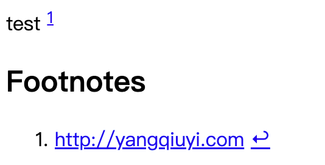

# remark-footnotes-extra

## Usage

```sh
pnpm add -D remark-footnotes-extra
``` 

```js
import remarkFootnotesExtra from "remark-footnotes-extra";
import rehypeStringify from "rehype-stringify";
import remarkParse from "remark-parse";
import remarkRehype from "remark-rehype";
import { unified } from "unified";

const processor = unified()
    .use(remarkParse)
    .use(remarkFootnotesExtra)
    .use(remarkRehype, { allowDangerousHtml: true })
    .use(rehypeStringify);

const value = "test^[http://yangqiuyi.com]";
const file = await processor.process(value);
console.log(String(file));
```

**output**:


